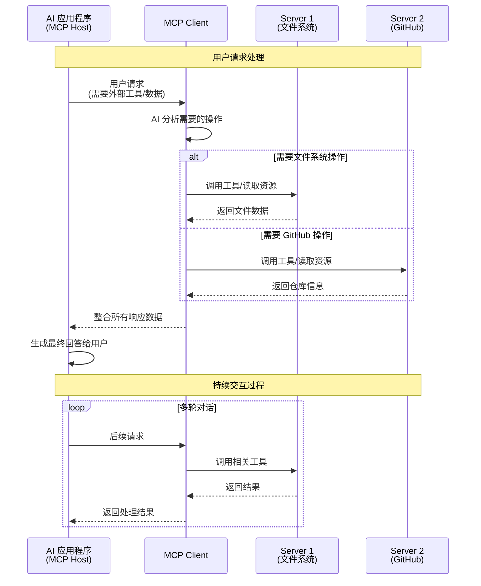

# 概述

> [!info]
>
> 更详细的内容可以访问 [官网](https://modelcontextprotocol.io/docs/getting-started/intro)
>
> 本文大部分也只是做了一部分官网内容的翻译而言（搬运工）

MCP(Model Context Protocol) 是 [Anthropic](https://www.anthropic.com/) 在 2024 年 11 月推出的[开源协议](https://www.anthropic.com/news/model-context-protocol)，用于将 AI 连接到外部的应用程序上，本质上是一个标准，规定了应用程序应该如何向 LLM 提供上下文。

> [!tip]
>
> 我的理解上来看更像是一个 [LSP](https://learn.microsoft.com/zh-cn/visualstudio/extensibility/language-server-protocol?view=vs-2022)，通过 LSP 我们可以将不同的编辑器为不同的语言提供自动补全/静态检查等功能，MCP 可以将 AI 视为编辑器，外部应用视为语言，通过协议能够为 AI 提供更加标准/准确的上下文，从而获得更好的服务

出现 MCP 的一大重要原因可能是提示词工程（Prompt Engineer）被认为非常重要（这甚至出了一门 [课程](https://learn.deeplearning.ai/)），调教好的提示词，更完善且结构化的上下文信息，能够显著提升 LLM 的输出/行为。

# 协议架构

MCP 的架构为传统的 `B-S` 架构，主要包含三个部分：

1. Host：带有 AI 功能的 IDE/编辑器
2. Server：提供具体工具/数据访问功能的组件
3. Client：被内置在 Host 中，用于与恰当的 Server 建立连接

我们用下图来表示其工作流程：



> [!bug] Mermaid 显示问题
>
> 由于[[blog-record#自定义代码块|我的魔改]]导致 Mermaid 无法正常显示，因此这里直接贴图吧


在这种架构下，开发者只需要专注开发 `Server` 即可，不需要关心 `Host` 和 `Client` 是如何实现的

> [!important]
>
> 这里需要注意，AI 会自己分析问题，然后自己决定需要连接哪些 MCP 服务器获取工具与相应的服务

那么就会引出一个很重要的问题：AI 如何确定自己选择对了 MCP 服务？

我们可以根据 [代码](https://github.com/modelcontextprotocol/python-sdk/blob/main/examples/clients/simple-chatbot/mcp_simple_chatbot/main.py) 来解释：

```py
class ChatSession:
    """Orchestrates the interaction between user, LLM, and tools."""
    async def start(self) -> None:
        """Main chat session handler."""
        try:
            for server in self.servers:
                try:
                    await server.initialize()
                except Exception as e:
                    logging.error(f"Failed to initialize server: {e}")
                    await self.cleanup_servers()
                    return

            all_tools = []
            for server in self.servers:
                tools = await server.list_tools()
                all_tools.extend(tools)

            tools_description = "\n".join([tool.format_for_llm() for tool in all_tools])

            system_message = (
                "You are a helpful assistant with access to these tools:\n\n"
                f"{tools_description}\n"
                "Choose the appropriate tool based on the user's question. "
                "If no tool is needed, reply directly.\n\n"
                "IMPORTANT: When you need to use a tool, you must ONLY respond with "
                "the exact JSON object format below, nothing else:\n"
                "{\n"
                '    "tool": "tool-name",\n'
                '    "arguments": {\n'
                '        "argument-name": "value"\n'
                "    }\n"
                "}\n\n"
                "After receiving a tool's response:\n"
                "1. Transform the raw data into a natural, conversational response\n"
                "2. Keep responses concise but informative\n"
                "3. Focus on the most relevant information\n"
                "4. Use appropriate context from the user's question\n"
                "5. Avoid simply repeating the raw data\n\n"
                "Please use only the tools that are explicitly defined above."
            )

            messages = [{"role": "system", "content": system_message}]

            while True:
                try:
                    user_input = input("You: ").strip().lower()
                    if user_input in ["quit", "exit"]:
                        logging.info("\nExiting...")
                        break

                    messages.append({"role": "user", "content": user_input})

                    llm_response = self.llm_client.get_response(messages)
                    logging.info("\nAssistant: %s", llm_response)

                    result = await self.process_llm_response(llm_response)

                    if result != llm_response:
                        messages.append({"role": "assistant", "content": llm_response})
                        messages.append({"role": "system", "content": result})

                        final_response = self.llm_client.get_response(messages)
                        logging.info("\nFinal response: %s", final_response)
                        messages.append({"role": "assistant", "content": final_response})
                    else:
                        messages.append({"role": "assistant", "content": llm_response})

                except KeyboardInterrupt:
                    logging.info("\nExiting...")
                    break

        finally:
            await self.cleanup_servers()
```

可以发现我们是通过 `prompt` 确定了当前有哪些工具，然后将工具的名字，描述（用途）和参数输出为一个 `json-rpc 2.0` 的形式，统一传入到 `system_message` 中，这样我们的 LLM 就能够识别有哪些工具，并自主选择合适的工具来完成用户的请求。
